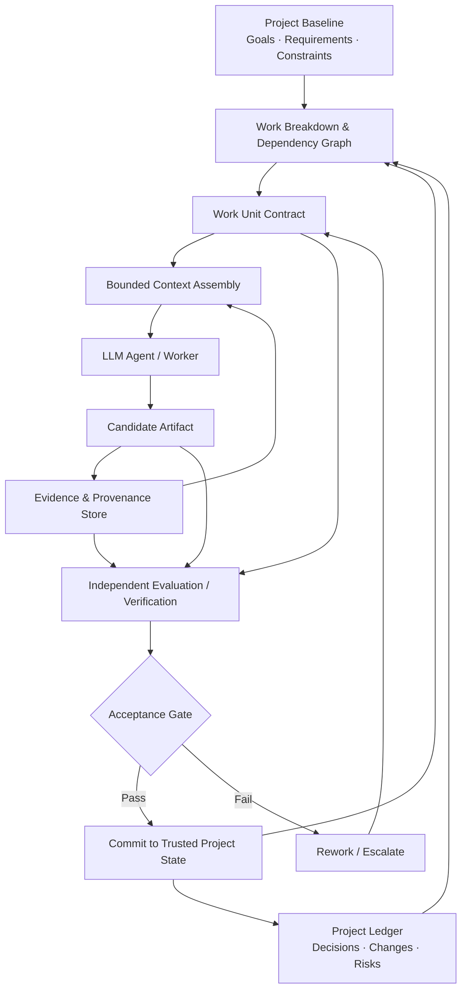
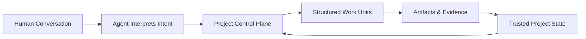

# Engineering Long-Horizon Work with LLM Agents - author - Paul Zedeck, CISSP-CCSP

## A Project-Control Architecture for Durable, Traceable, and Verifiable AI Collaboration

> **Status:** Research synthesis and proposed reference architecture  
> **Audience:** AI engineers, researchers, architects, program managers, assurance teams, and organizations using LLM-based agents for work that spans multiple sessions, days, weeks, or months  
> **Scope:** Vendor-neutral; applicable across software engineering, research, analysis, governance, documentation, and other artifact-producing knowledge work  
> **Last reviewed:** 2026-09-08  
>
> **Important:** The **Agentic Project Control Plane (APCP)** described here is a proposed synthesis, not an established industry standard, commercial product, or claim that one framework solves long-horizon agent reliability.

---

## Executive summary

Large language model (LLM) agents are increasingly used as collaborators on work that extends far beyond a single prompt or chat session. The central engineering problem is not simply whether a model has a large enough context window. It is whether a system can preserve **correct project state, evidence, decisions, dependencies, and acceptance criteria** across many bounded model invocations without allowing information to drift.

Research on long-context LLMs shows that larger context windows do not guarantee reliable use of all information in context. *Lost in the Middle* demonstrated sensitivity to the position of relevant information in long inputs.[1] RULER found that performance often falls as context length and task complexity increase, even when nominal context limits are much larger.[2] LongMemEval found substantial degradation in long-term memory tasks across sustained interaction histories and framed long-term memory as an indexing, retrieval, and reading problem rather than a simple matter of retaining an ever-growing transcript.[3] More recent work on long-horizon software agents identifies append-only context and passive compression as sources of context growth, semantic drift, and degraded reasoning.[4]

Industry experiments with long-running agents point in the same direction. Anthropic reported that compaction alone was insufficient for reliable work across many context windows and used incremental tasks plus structured artifacts to transfer state between sessions.[5] Later work added explicit planner, generator, and evaluator roles, again emphasizing task decomposition, structured handoffs, and independent evaluation.[6]

The resulting design principle is:

> **Treat the LLM agent as a bounded reasoning worker, not as the authoritative memory of the project.**

For long-horizon work, continuity should reside in durable project artifacts and structured state outside the model. Each agent invocation should receive only the bounded, authoritative context required for a specific work unit. Outputs should not become trusted project state until they satisfy explicit acceptance criteria and, where risk warrants, independent verification.

This article proposes a reference architecture called the **Agentic Project Control Plane (APCP)**:

> **The agent is replaceable. The project state is durable.**

---

## 1. Terminology and scope

This article uses **LLM-based agent** to mean a system in which a generative language model can reason over supplied context, invoke tools, produce artifacts, and participate in a multi-step workflow.

The term **Artificial Narrow Intelligence (ANI)** is sometimes used for present-day task-bounded AI systems. The boundaries between "ANI," "general-purpose models," and possible future forms of general intelligence are debated. Nothing in this article depends on that taxonomy. The engineering concern is narrower: **current LLM-based agents operate through bounded model invocations and can produce incorrect or internally inconsistent outputs.**

NIST describes generative-AI **confabulation** as confidently presented erroneous or false content and notes that generated outputs may also contradict prior statements.[7] For long-running projects, this means project continuity and assurance should not depend on a model correctly reconstructing months of prior work from conversational history alone.

Elapsed wall-clock time is not itself the limiting variable. A project can pause for a month without consuming context. The problem is that a long-running project accumulates **state**—requirements, decisions, evidence, artifacts, dependencies, exceptions, changes, and unresolved questions—that must be reconstructed accurately for later model invocations.

---

## 2. Research proposition

A useful engineering proposition for long-horizon agentic work is:

> **An LLM agent should be considered a bounded reasoning worker rather than the authoritative memory of a long-running project. Projects spanning many sessions therefore require an external control system that decomposes work, persists authoritative state, reconstructs bounded context for each work unit, records provenance, and verifies outputs before they become trusted project state.**

The research does not establish that every agentic workload requires the same implementation. It does support the underlying concerns:

- long context is not used uniformly or perfectly;[1][2]
- long-term conversational memory remains a separate retrieval-and-reasoning problem;[3]
- append-only history and passive compression can degrade long-horizon reasoning;[4]
- structured task decomposition and artifact-based handoffs can improve continuity across context boundaries;[5][6]
- generative systems can produce confidently wrong or inconsistent content, making verification and provenance important in consequential work.[7]

The key architectural consequence is:

> **The unit of project continuity should be the project record, not the conversation transcript.**

---

## 3. Why "more memory" is not the complete solution

Several mechanisms are often grouped together under the word *memory*, but they solve different problems.

| Mechanism | What it helps preserve | What it does **not** prove |
|---|---|---|
| Large context window | More information in one invocation | That the model will use all information correctly |
| Conversation history | Prior exchanges | That prior exchanges are factually correct or still current |
| Retrieval / RAG | Relevant stored information | That the retrieved information is complete, authoritative, or properly interpreted |
| Summarization / compaction | Reduced token use | That omitted details were unimportant |
| Checkpointing | Runtime or graph state | That the state contains correct conclusions |
| Durable workflow execution | Progress across failures and long waits | That an agent output satisfies a requirement |
| Project control and assurance | Traceability, acceptance, provenance, verification | Model capability itself |

For example, LangGraph can checkpoint graph state for persistence, recovery, human-in-the-loop workflows, and replay.[13] AutoGen can save and reload agent and team state.[14] OpenAI's Agents SDK provides session persistence and compaction, and separately documents durable orchestration integrations for long waits, retries, and process restarts.[12] These are useful infrastructure capabilities, but they do not by themselves answer questions such as:

- Which requirement does this output satisfy?
- What source evidence supports the conclusion?
- Was the source version current when the conclusion was made?
- Were assumptions recorded explicitly?
- Was the output independently checked?
- What should happen if an upstream requirement changes?

Those are project-control and assurance questions.

---

## 4. Proposed reference architecture: Agentic Project Control Plane

The **Agentic Project Control Plane (APCP)** is a conceptual synthesis of project-management, systems-engineering, durable-workflow, provenance, and agent-harness practices.

It assumes that individual model sessions are temporary and that durable project state exists outside them.



The architecture has seven major responsibilities:

1. **Maintain a project baseline.**
2. **Decompose work into bounded, traceable work units.**
3. **Assemble context for the current work unit instead of accumulating all prior context.**
4. **Preserve evidence and provenance separately from model-generated summaries.**
5. **Persist workflow state independently of any one model invocation.**
6. **Verify candidate outputs against explicit acceptance criteria.**
7. **Commit only accepted results into trusted project state.**

---

## 5. Hierarchical work decomposition

Traditional project management already provides a useful mechanism for breaking large scope into manageable parts: the **Work Breakdown Structure (WBS)**. PMI defines a WBS as a hierarchical decomposition of total project scope, with the lowest managed level represented by work packages.[8]

For agentic work, the same idea can be extended into machine-addressable units:

```text
PROJECT
  └── OBJECTIVE
      └── CAPABILITY / DELIVERABLE
          └── WORK PACKAGE
              └── WORK UNIT
                  └── ATOMIC TASK
```

Each unit should have a stable identifier. A work unit should be small enough that its required inputs, expected output, and acceptance criteria can fit comfortably within a bounded working context.

The goal is not to force every project into one rigid hierarchy. The goal is to ensure that an agent never receives an unbounded instruction such as:

> "Finish the project."

Instead, it receives something closer to:

> "Complete work unit `WU-042`, using inputs `SRC-017` and `ART-031`, subject to requirements `REQ-008` and `REQ-012`, and produce an artifact that satisfies acceptance tests `AC-042-1` through `AC-042-4`."

That is a controllable unit of work.

---

## 6. The Work Unit Contract

A long-running agent should normally operate from a **Work Unit Contract** rather than an informal conversational request.

A minimum contract can contain:

| Field | Purpose |
|---|---|
| `work_unit_id` | Stable identity |
| `parent_id` | Position in the project hierarchy |
| `objective` | Exact outcome required |
| `scope_in` | What may be changed, analyzed, or produced |
| `scope_out` | Explicit exclusions |
| `authoritative_inputs` | Primary sources and trusted upstream artifacts |
| `dependencies` | Work that must already be accepted |
| `assumptions` | Explicit assumptions |
| `constraints` | Technical, legal, policy, security, cost, or operational constraints |
| `acceptance_criteria` | Objective conditions for completion |
| `verification_method` | Test, inspection, comparison, analysis, review, or other method |
| `required_output` | Expected artifact and format |
| `provenance_requirements` | Required citations, source identifiers, versions, or hashes |
| `risk_level` | Determines review and approval rigor |
| `status` | Planned, ready, active, blocked, review, accepted, rejected |
| `result_artifacts` | Outputs produced |
| `verification_evidence` | Evidence supporting acceptance |
| `successors` | Work units enabled after acceptance |

The contract is intentionally more structured than a prompt. It is a persistent project object that can be rendered into prompts for different models or agent frameworks.

---

## 7. Context should be assembled, not accumulated

Long-running work often fails when each new interaction inherits an increasingly large transcript and expects the model to identify what still matters.

LongMemEval frames durable conversational memory as an **indexing → retrieval → reading** problem and demonstrates that memory-system design materially affects performance.[3] *Context as a Tool* similarly argues against append-only context and passive compression, instead separating stable task semantics, condensed long-term memory, and high-fidelity recent interactions under a bounded context budget.[4]

An APCP-style system therefore constructs a temporary **context package** for each work unit:

```text
ROLE / OPERATING CONSTRAINTS
        +
WORK UNIT CONTRACT
        +
RELEVANT REQUIREMENTS
        +
RELEVANT DECISIONS
        +
AUTHORITATIVE SOURCE MATERIAL
        +
ACCEPTED DEPENDENCY OUTPUTS
        +
ACCEPTANCE CRITERIA
        +
RECENT LOCAL WORK STATE
        =
BOUNDED WORKING CONTEXT
```

When the work unit ends, that working context can be discarded. Durable results are written back as structured project state, artifacts, and evidence.

This makes a fresh agent session a normal operating condition rather than a failure condition.

---

## 8. Primary evidence must outrank summaries

Summaries are useful navigation aids, but repeated summarization can create information loss and semantic drift.

A risky chain looks like this:

```text
Primary source
    ↓
Agent summary
    ↓
Summary of summary
    ↓
Project-memory summary
    ↓
Later agent interpretation
    ↓
Final decision
```

The safer pattern preserves lineage:

```text
Primary source ──────────────────────────────┐
    ↓                                        │
Interpretation                              │
    ↓                                        │
Decision                                   │
    ↓                                        │
Summary                                    │
                                             │
Every derived object retains ────────────────┘
a pointer to its supporting evidence
```

A future agent should be able to traverse:

> **conclusion → analysis → evidence → authoritative source**

That relationship is **provenance**.

For important work, the source record should also preserve enough metadata to detect staleness or substitution, such as source identity, version/date, retrieval date, and—where appropriate—content hashes.

---

## 9. Requirements traceability and change impact

Systems engineering provides another important pattern: **bidirectional traceability**.

NASA guidance describes bidirectional traceability as maintaining associations that can be followed in both directions and recommends unique requirement identifiers, captured requirement sources, and maintained traceability throughout the project lifecycle.[9] It also links requirements to design, implementation, and test evidence.

Applied to agentic project work:

```text
Requirement REQ-001
    │
    ├── Work Unit WU-014
    │      │
    │      └── Artifact ART-027
    │              │
    │              └── Evidence EV-114
    │
    └── Verification VER-009
             │
             └── PASS
```

This provides two important capabilities.

**Completion evidence:** A requirement is not considered satisfied merely because an agent says it is complete.

**Change impact:** If `REQ-001` changes, the system can identify downstream work units, artifacts, decisions, and verification results that may need reevaluation.

---

## 10. Independent evaluation should gate trusted state

One of the strongest patterns in recent long-running-agent experiments is separation between the agent that produces work and the agent or mechanism that evaluates it.

Anthropic's 2026 long-running application work used a planner–generator–evaluator structure and emphasized concrete grading criteria for outputs.[6] This is compatible with established verification practice: an output should be judged against defined criteria rather than accepted because the producer asserts completion.

A high-assurance pattern is:

```text
Work Unit
   ↓
Executor
   ↓
Candidate Artifact
   ↓
Fresh Evaluator
   ↓
PASS ──────────────── FAIL
 │                     │
Commit trusted state   Rework / escalate
```

The evaluator does not necessarily need the executor's full conversational history. It may instead receive:

- the work-unit objective,
- authoritative inputs,
- applicable requirements,
- acceptance criteria,
- the candidate artifact,
- required evidence.

This helps reduce correlated framing errors and keeps evaluation focused on observable requirements.

Evaluation can combine deterministic tests, rule-based checks, a second model, a human reviewer, or multiple mechanisms depending on risk.

### Suggested risk-based assurance pattern

This is a design recommendation, not an external standard:

| Risk | Example assurance |
|---|---|
| Low | Automated checks; agent self-check may be sufficient |
| Moderate | Deterministic checks plus fresh-context model review |
| High | Independent evaluation plus accountable human approval |
| Critical | Formal verification/validation procedures appropriate to the domain; AI output treated as advisory until accepted |

---

## 11. Durable execution is not the same as memory

A project may pause for a human decision, an external event, an approval, or a dependency for hours or months. The model does not need to remain active during that period.

A durable workflow engine can persist the state machine and resume later. Temporal describes workflows that preserve running state, recover after failure, and can run for days, weeks, or months.[10] Dapr similarly provides workflow-backed durable agents whose state can survive crashes and restarts.[11] The OpenAI Agents SDK separately documents durable orchestration integrations for long waits, retries, human-in-the-loop steps, and process restarts.[12]

This yields an important separation:

> **Agent memory is about information available to a model. Durable execution is about whether the process survives time and failure. Project assurance is about whether the resulting state deserves to be trusted.**

A robust long-horizon system may need all three.

---

## 12. Four forms of project "memory"

For clarity, it is useful to separate four categories:

| Memory type | Typical contents | Recommended authority |
|---|---|---|
| **Working context** | Current prompt, local reasoning inputs, recent tool results | Disposable |
| **Episodic memory** | Prior interactions, progress notes, lessons, summaries | Informational |
| **Project state** | Requirements, work status, dependencies, decisions, approved artifacts | Authoritative within the project |
| **Evidence store** | Primary sources, datasets, test results, source versions, provenance | Highest evidentiary authority |

The ordering matters.

An agent statement such as:

> "I remember that the requirement was X."

should carry much less authority than:

> "`REQ-241` states X, derived from source `SRC-019`, version 3.2, section 4.2."

The first is recollection. The second is traceable project state.

---

## 13. Conversation should be an interface, not the system of record

Natural-language conversation remains valuable. It is often the easiest way for a human to express intent, explore alternatives, resolve ambiguity, and collaborate with an agent.

But the conversation transcript should not be the only authoritative project database.

A stronger pattern is:



Under this model, conversation is a **user interface to structured project state**.

The transcript can still be retained for audit, reconstruction, or usability, but requirements, d